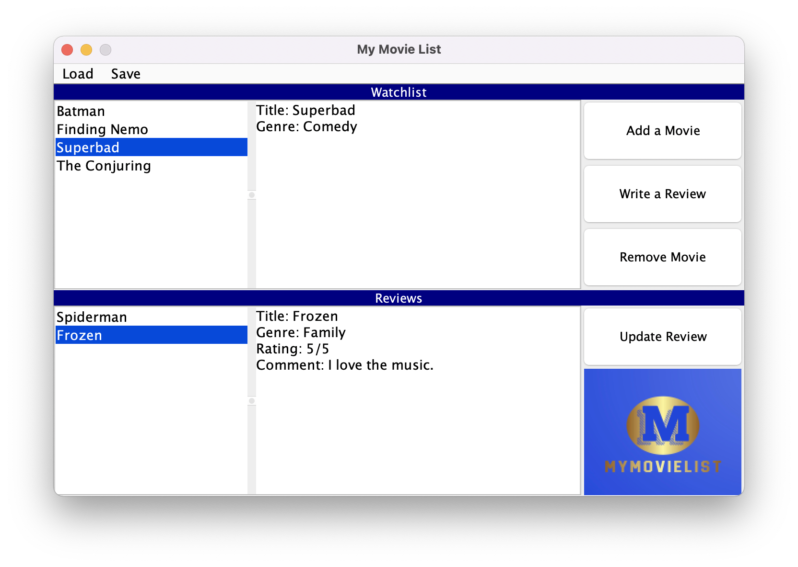

# CPSC 210 Personal Project

## MyMovieList

**MyMovieList** is an application that helps users keep track of movies they have seen. With this app, users will be 
able to create a watchlist of movies they would like to see. In addition, users will also be able to leave reviews of 
movies they have previously watched. Reviews will include a rating on a scale of one to five stars and a comment about 
what they thought about the movie.

This application will cater towards those who enjoy watching movies and enjoy providing recommendations to others. My
main inspiration for this app came from websites such as *Goodreads* and *MyDramaList*. *Goodreads* allows users to create
lists of books they intend on reading as well as leaving reviews for books they have already read. *MyDramaList* has
similar features for television shows. As someone who enjoys watching new movies as well as re-watching old movies, an
app such as **MyMovieList** would be very useful to have.

